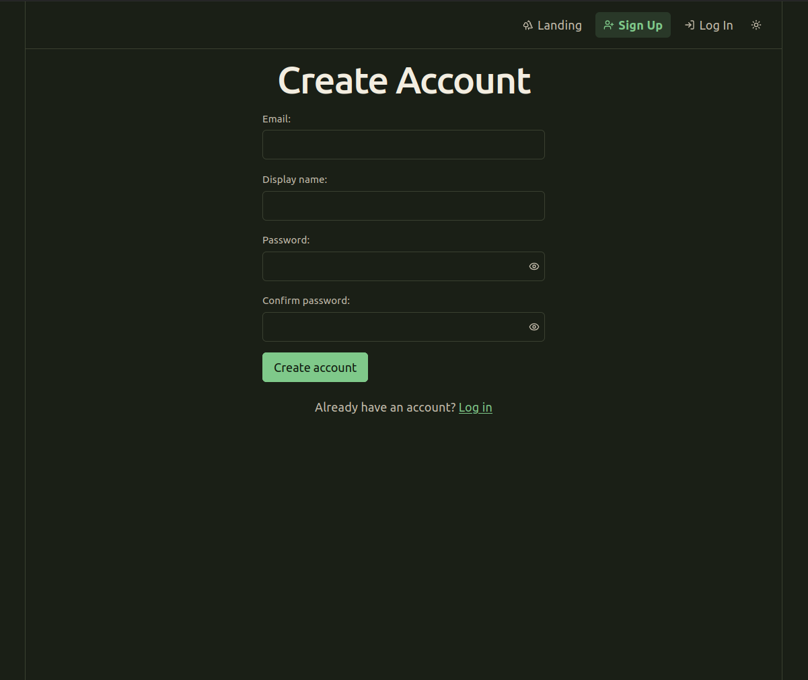
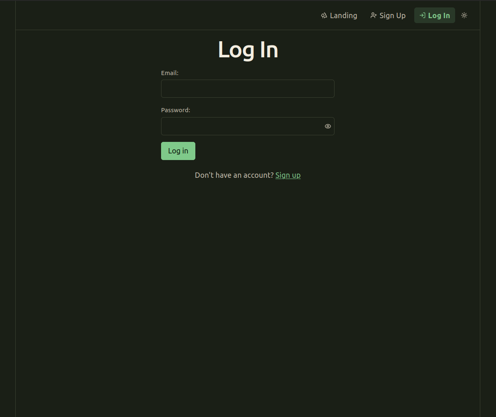
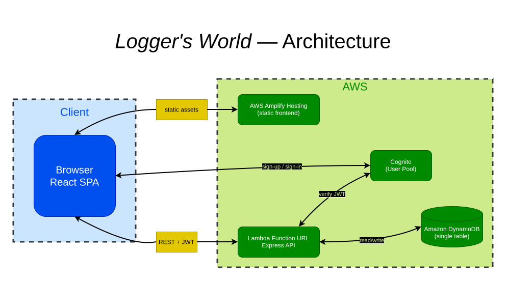

<p align="center">
  
</p>

<h1 align="center">Logger's World</h1>

---

A web app for tracking anything you want to log — books, workouts, movies, habits — by defining your own log types (name + typed fields) and then adding entries against them.

**Live demo:** https://loggersworld.literaturelounge.org

Built as a one-week, full-SDLC portfolio project to demonstrate cloud infrastructure, serverless backend design, and NoSQL data modeling — see [`artifacts/roadmap.md`](artifacts/roadmap.md) for the day-by-day build log.

## Demo

<p align="center">
  
  
</p>

Walkthrough of the core flow — creating a log type, adding an entry, editing it: [`artifacts/demo/loggersworld-demo.webm`](artifacts/demo/loggersworld-demo.webm) *(click through to GitHub's file view to play it inline)*

## Architecture



- **Frontend** — React (Vite), hosted on AWS Amplify Hosting, auto-built from `main`
- **Auth** — Amazon Cognito User Pool; the frontend talks to Cognito directly for sign-up/sign-in and attaches the resulting JWT to every API call
- **API** — Express app running inside a single AWS Lambda function, exposed via a Function URL (no API Gateway); JWT verification middleware extracts the caller's identity and scopes every query to their own data
- **Data** — Amazon DynamoDB, single-table design (`LogType` and `LogEntry` items share one table, partitioned per user — see [`artifacts/data-models.md`](artifacts/data-models.md))
- **Infrastructure** — the whole backend (table, user pool, Lambda, IAM) is defined in AWS CDK (TypeScript), see [`infra/`](infra/)
- **CI/CD** — GitHub Actions lints/tests every push and PR, then runs `cdk deploy` on merge to `main`; Amplify Hosting rebuilds the frontend on the same push

Full technology rationale and free-tier notes: [`artifacts/logging-app-tech-stack.md`](artifacts/logging-app-tech-stack.md). API contract: [`artifacts/api-contract.md`](artifacts/api-contract.md).

## Project structure

```
backend/    Express API (deployed into Lambda via serverless-http)
frontend/   React/Vite app
infra/      AWS CDK stack (DynamoDB, Cognito, Lambda, IAM)
artifacts/  design docs: requirements, data models, API contract, roadmap
```

## Local setup

Requires Node.js ≥ 20 and an AWS account with the CLI configured (`aws configure`).

### 1. Deploy the infrastructure

```bash
cd infra
npm install
cp .env.example .env   # set FRONTEND_ORIGIN, e.g. http://localhost:5173
npx cdk deploy
```

Note the three CloudFormation outputs (`BackendFunctionUrlOutput`, `UserPoolIdOutput`, `UserPoolClientIdOutput`) — you'll need them for the frontend's `.env` below.

### 2. Run the backend locally (optional)

The deployed Lambda is what the frontend talks to by default; running the backend locally is only needed if you're changing API code and want to test outside Lambda.

```bash
cd backend
npm install
npm test
```

### 3. Run the frontend

```bash
cd frontend
npm install
cp .env.example .env   # fill in VITE_USER_POOL_ID, VITE_USER_POOL_CLIENT_ID, VITE_FUNCTION_URL from step 1's outputs
npm run dev
```

## Tests

```bash
npm test --prefix backend
npm test --prefix frontend
npm test --prefix infra
```

The same commands run in CI on every push/PR — see [`.github/workflows/ci.yml`](.github/workflows/ci.yml).
